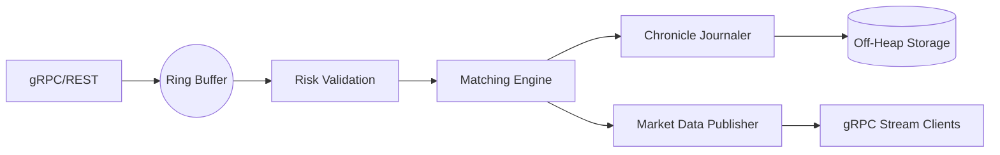

# Ultra Low Latency Trading Engine

A production-grade High-Frequency Trading (HFT) Matching Engine built with Java 21, LMAX Disruptor, and Chronicle Map.

## Architecture

The system follows a **Clean Architecture / Hexagonal** design, optimized for ultra-low latency and high throughput using lock-free programming patterns.

### Core Components
- **Matching Engine Core**: Single-threaded order book implementation per symbol to avoid locking. Uses price-time priority.
- **LMAX Disruptor**: High-performance inter-thread messaging system. Acts as the event backbone.
- **Chronicle Map**: Off-heap persistence for order books and trade history, ensuring zero GC impact.
- **gRPC Server**: Low-latency communication layer for order submission and market data streaming.
- **Project Reactor**: Used for reactive market data streaming.

### Event Pipeline


## Tech Stack
- **Java 21**: Virtual Threads, Records, and ZGC.
- **Spring Boot 3.2**: Bootstrapping and DI.
- **LMAX Disruptor 4.0**: Lock-free concurrency.
- **Chronicle Map**: Off-heap memory management.
- **gRPC & Protobuf**: Binary serialization and RPC.
- **Micrometer & JMX**: Monitoring and metrics.
- **JMH**: Micro-benchmarking.

## Getting Started

### Prerequisites
- JDK 21
- Maven 3.9+
- Docker & Docker Compose

### Building the Project
```bash
mvn clean package
```

### Running with Docker
```bash
docker-compose up --build
```

### Benchmarking
To run the JMH performance benchmarks:
```bash
mvn clean install
java -jar benchmarking-module/target/benchmarks.jar
```

## JVM Tuning for Low Latency

The engine is optimized for **ZGC** to minimize pause times.

Recommended JVM Flags:
```text
-XX:+UseZGC 
-XX:+ZGenerational 
-XX:+UseLargePages 
-XX:+AlwaysPreTouch 
-Xms4g -Xmx4g 
-XX:MaxDirectMemorySize=2g
-XX:ThreadStackSize=256k
```

## API Documentation

### gRPC Endpoints
- `SubmitOrder`: Place a new LIMIT, MARKET, or IOC order.
- `CancelOrder`: Cancel an existing order by ID.
- `StreamMarketData`: Bi-directional stream for real-time order book updates and trades.

### Metrics
Exposed via Spring Boot Actuator at `http://localhost:8080/actuator/prometheus`.
- `trading.engine.matching.latency`: Timer for matching logic.
- `trading.engine.orders.count`: Total orders processed.
- `trading.engine.trades.count`: Total trades executed.

## License
MIT
