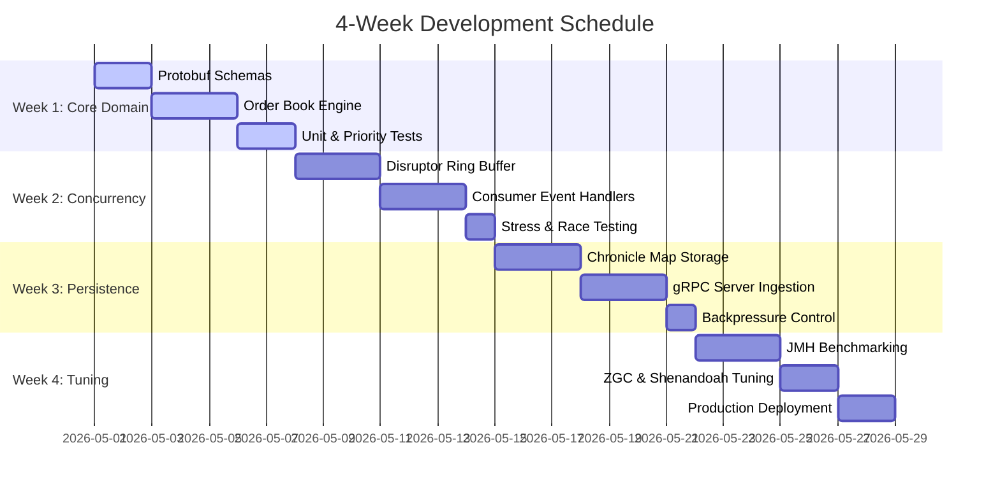

# ⚡ Project 1: High-Performance Order Matching Engine (FinTech)

A production-grade, low-latency financial trading core designed to match buy and sell orders for a high-frequency cryptocurrency or stock exchange. By operating entirely **in-memory** during active trading sessions, this engine bypasses traditional database bottlenecks. It leverages advanced concurrency models and lock-free ring-buffer data structures to achieve sub-millisecond execution times and comfortably scale to handle millions of transactions per second.

---

## 🏛️ Project Information

> [!NOTE]
> **Core Architecture:** The engine is built on a lock-free single-writer thread pattern to ensure absolute consistency and determinism in matching logic, without the CPU cache-bouncing associated with heavy thread locks.

- **In-Memory Operations:** All active order books and matching states are processed entirely within RAM.
- **Low Latency Processing:** Optimized data layouts and custom data structures ensure predictable sub-millisecond round-trip latencies.
- **Throughput Scalability:** Engineered to process millions of trade events per second under high market volatility.

---

## 🛠️ Tech Stack

| Component | Technology | Role & Details |
| :--- | :--- | :--- |
| **Language** | `Java 21` | Leveraging **Virtual Threads** (Project Loom) for lightweight task management and modern memory API capabilities. |
| **Concurrency Framework** | `LMAX Disruptor` | Provides ultra-high-throughput, lock-free, and extremely low-latency inter-thread messaging via circular ring buffers. |
| **Memory Management** | `Chronicle Map` | Off-heap key-value storage used to achieve Zero-GC pauses and real-time asynchronous state persistence. |
| **Communication** | `gRPC & Protocol Buffers` | Fast, typed, binary-serialized microservice communications for external gateway ingestion and market data feeds. |
| **Testing & Validation** | `JMH & JUnit 5` | Microbenchmarking using the **Java Microbenchmark Harness** alongside exhaustive test suites for matching rules. |

---

## 🌟 Expected Impact

- **Scalable Infrastructure:** Handles massive spikes in market activity and heavy volume spikes without systemic degradation or queue-clogging.
- **Fair Execution Guarantees:** Extremely low jitter and predictable latency bounds ensure fair order matching, reducing execution slippage for institutional and retail traders alike.
- **GC Isolation:** Moves hot-path objects completely off-heap, isolating the engine from standard JVM Garbage Collection latency spikes.

---

## 📅 4-Week Development Timeline

### 🔹 Week 1: Core Domain & Data Structures
*   **Day 1-2:** Define Protocol Buffer schemas (`.proto`) for `Order`, `Trade`, and real-time `Market Data` events.
*   **Day 3-5:** Implement core matching logic (`OrderBook`, `PriceLevels`) using primitive arrays and object pooling patterns to completely eliminate GC garbage collection overhead in the active loop.
*   **Day 6-7:** Write extensive unit tests to strictly validate price-time priority (FIFO) order matching.

### 🔹 Week 2: LMAX Disruptor Integration
*   **Day 1-3:** Configure the `LMAX Disruptor` ring buffer to decouple incoming order ingestion from matching and execution threads.
*   **Day 4-6:** Implement specific, dedicated consumer event handlers:
    *   *Matching Engine Handler* (executes matches sequentially)
    *   *Risk Validation Handler* (pre-trade checks)
    *   *Journaling Handler* (records input transactions)
*   **Day 7:** Run high-concurrency multi-threaded stress tests to isolate potential race conditions or direct memory leaks.

### 🔹 Week 3: Off-Heap Persistence & Networking
*   **Day 1-3:** Integrate `Chronicle Map` to asynchronously persist active order book states straight to disk without blocking the main execution path.
*   **Day 4-6:** Build the `gRPC` server to accept high-speed external trade requests and stream live market data snapshots to clients.
*   **Day 7:** Implement connection pooling policies and custom backpressure streaming controls.

### 🔹 Week 4: Benchmarking & JVM Tuning
*   **Day 1-3:** Conduct exhaustive micro-benchmarks with `JMH` to find bottlenecks, and optimize CPU cache line padding (`@Contended`) to prevent performance-killing false sharing.
*   **Day 4-5:** Fine-tune modern garbage collectors (`ZGC` / `Shenandoah`) for ultra-low-latency real-time processing profiles.
*   **Day 6-7:** Finalize robust production deployment scripts, metrics monitoring hooks (`JMX`/`Prometheus`), and release technical specifications.
