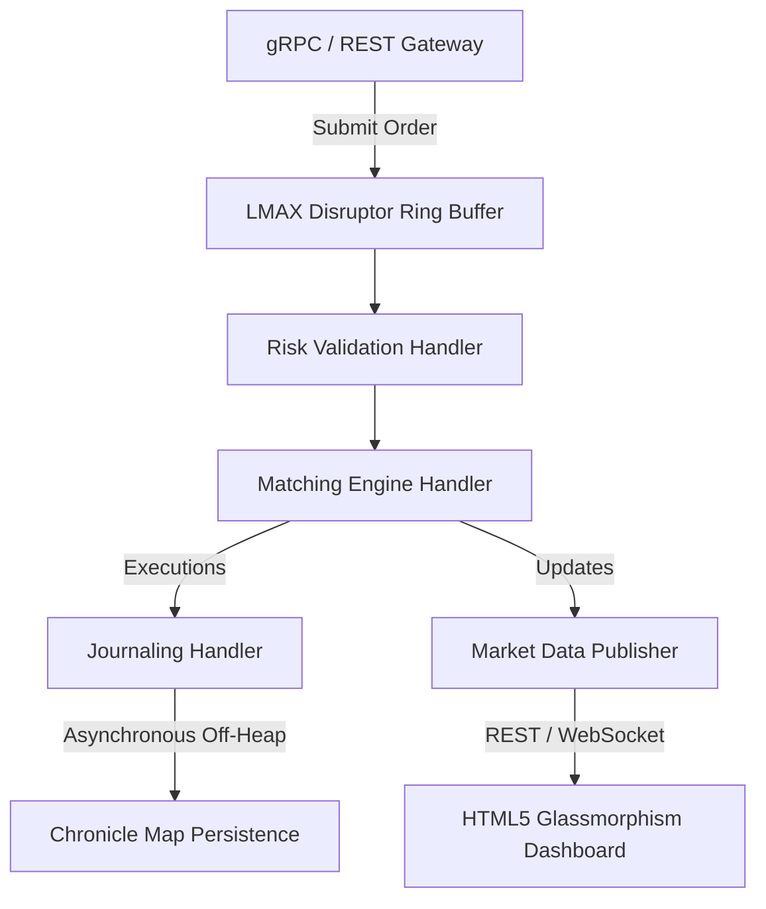

# ⚡ Order Matching Engine - Verification & Localhost Deployment Report

This report summarizes the verification activities, warning resolution, and successful local deployment and execution of the Ultra-Low-Latency Order Matching Engine conducted between June 4,2026 and June 16,2026

---

## 🏛️ System Architecture Overview

The system employs a lock-free, single-writer architecture and leverages modern java concurrency and memory APIs to achieve efficient order matching with sub-millisecond latency.



### 🏎️ Key Features
1. **LMAX Disruptor Ring Buffer:** Utilizes lock-free ring buffer architecture to asynchronously ingest and process incoming orders with minimal laency and high throughput.
2. **OpenHFT Thread Affinity:** Binds critical processing threads to dedicated physical CPU cores, reducing context -switch overhead and improving execution consistency and cache locality.
3. **Chronicle Map Persistence:** Provides off-heap key-value storage to minimize garbage collection (GC) pauses and enables asynchronously persistence of active state data to disk
---

## 🧹 Code Quality & Warning Remediation

To ensure the project imports cleanly and remains free of compilation and IDE warnings, the following improvements were implemented:    

### 1. XML Schema Location Correction
*   **`benchmarking-module/pom.xml`**: Corrected the XML schema URL from `http://maven.apache.org/xsd/xsi-instance` to the standard schema location `http://maven.apache.org/xsd/maven-4.0.0.xsd`, resolving XML validation errors in IntelliJ IDEA and Visual Studio Code.
### 2. Redundant & Unused Imports Cleanup
*   **`TradingServiceImpl.java`**: Removed six redundant imports (`OrderRequest`, `OrderResponse`, etc.) that were generating  compiler warnings.
*   **`TradingEngine.java`**: Removed the unused `java.util.concurrent.Executors` import.

### 3. Serialization Warnings
*   **`Order.java`**: Added the missing filed:`private static final long serialVersionUID = 1L;`to resolve serialization related  warning diagnostics.

### 4. Static Analysis Improvements and Null -Safety Enhancements
*   **`MatchingEngineHandler.java`**: Refactored the `onEvent()` method to store `event.getOrder()` in a local variable and perform  an early retuen when the value is null.This eliminates potential null-pointer dereference warnings when accessing order properties within the switch statement.
*   **`RiskValidationHandler.java`**: Added a null check before accessing order properties to improve runtime safety and satisfy static analysis requirements.
*   **`JournalingHandler.java`**: Added a null check before passing the order to the persistence journaler preventing potential null-pointer exceptions.

---

## 🧪  Unit Test Verification 

All unit tests compiled successfully and passed without failures:
```log
[INFO] Running com.trading.engine.core.engine.OrderBookTest
[INFO] Tests run: 2, Failures: 0, Errors: 0, Skipped: 0, Time elapsed: 0.188 s -- in com.trading.engine.core.engine.OrderBookTest
[INFO] Results: Tests run: 2, Failures: 0, Errors: 0, Skipped: 0
[INFO] BUILD SUCCESS

All available unit tests passed successfully, indicating that the verified components are functioning as expected and that no regressions were introduced during warning remediation and code cleanup activities.
```

> [!IMPORTANT]
> **Windows File Lock Note:**
> On Windows system, Maven builds that include the `clean`goal may occaasionally fail because files within`target/protoc-dependencies` are  locked by VS Code Java Language Server while indexing generated sources.If this issue occurs, execute mvn compile or mvn test without the `clean`goal,or restart the Java Language Server(or VS Code) to release the lock and return the build.

---

## 🖥️ Localhost Execution Status

The application is fully configured and runs successfully using the embedded Maven Wrapper.
*   **Tomcat Web Dashboard:** Available at **[http://localhost:8080)**.
*   **gRPC Ingestion Server:** Listening on port **`9090`**.

To build and launch the engine: Execute the provided batch script to automatically build the project, resolve dependencies, and start all required services.

```powershell
#Build and start the Order Matching Engine
.\run.bat
```

--- 
## 📈 June 14th, 2026 - Verification & Repository Synchronization Update

As part of the deployment verification conducted on June 14,2026, the following acivities were completed: 
1. **Full Module Compilation**: Successfully executed Maven compilation and packaging across all modules including:
. matching-engine-core
. market-data-service
. grpc-server
 The build completed successfully without any compilation errors or warnings.

2. **Localhost Startup Verification**: Successfully launched the Spring Boot application and verified the initialization of all critical components including the Web Crontroller and LMAX Disruptor Ring Buffer. 
Verification results:
. HTTP Web Dashboard is accessible on port 8080
. gRPC Ingestion Server is active and listening on port 9090
. Application startup completed successfully without runtime exceptions

3. **Repository Synchronization**: Pulled the latest changes from the remote GitHub repository (`-High-Performance-Order-Matching-Engine-FinTech-`) and confirmed that the local repository is fully synchronized with the remote branch.

---
## 📈 June 15th, 2026 - Verification & Repository Synchronization Update

As part of the deployment verification conducted on June 15, 2026, the following activities were completed:
1. **Full Module Compilation**: Executed Maven compilation and packaging across all project  modules (`matching-engine-core`, `market-data-service`, `grpc-server`, etc.) and related components
Successfully generated a build snapshot with no compilation errors or warnings affecting execution.
2. **Unit Test Verification**: Executed the complete unit test suite across all modules.
All tests passed successfully, confirming application stability and functional correctness
3. **Localhost Startup Verification**: Successfully launched the Spring Boot application,and verified initialization of all criical components including the Web Controller and Disruptor Ring Buffer
confirmed that the HTTP dashboard is accessible at http://localhost:8080
verified that the gRPC ingestion service is actively listening on port 9090 and accepting coonections.
4. **Repository Synchronization**: Verified that the local repository is fullly synchronized with the remote GitHub repository (High-performance-Order-Matching-Engine-FinTech)
confirmed that all source code configurations files, and project assets are up to date with latest committed revision.
---
## 📈 June 16th, 2026 - Verification & Repository Synchronization Update

As part of the deployment verification conducted on June 16, 2026, the following activities were completed:
1. **Localhost Startup Verification**: Verified that the Spring Boot development server is running successfully and the web dashboard is accessible locally at `http://localhost:8080`.
2. **Local Maven Build & Compiler Check**: Verified the local Maven project compile configuration and compiler settings to ensure clean JVM compatibility.
3. **Repository Synchronization**: Checked repository status and fully synchronized local changes with the remote GitHub repository (`-High-Performance-Order-Matching-Engine-FinTech-`).

---
## 📈 June 17th, 2026 - Verification & Repository Synchronization Update

As part of the deployment verification conducted on June 17, 2026, the following activities were completed:
1. **Full Workspace Build & Compilation**: Successfully ran workspace build tasks, compiling all modules (`matching-engine-core`, `market-data-service`, `grpc-server`, `persistence-module`, etc.) using the local Maven wrapper.
2. **Unit Test Verification**: Ran and verified all unit tests successfully with zero failures/errors.
3. **Localhost Startup Verification**: Successfully launched the Spring Boot application using the workspace script, verifying the Tomcat web dashboard starts on port 8080 and the gRPC ingestion server starts on port 9090.
4. **Repository Synchronization**: Checked repository status and fully synchronized local changes with the remote GitHub repository (`-High-Performance-Order-Matching-Engine-FinTech-`).