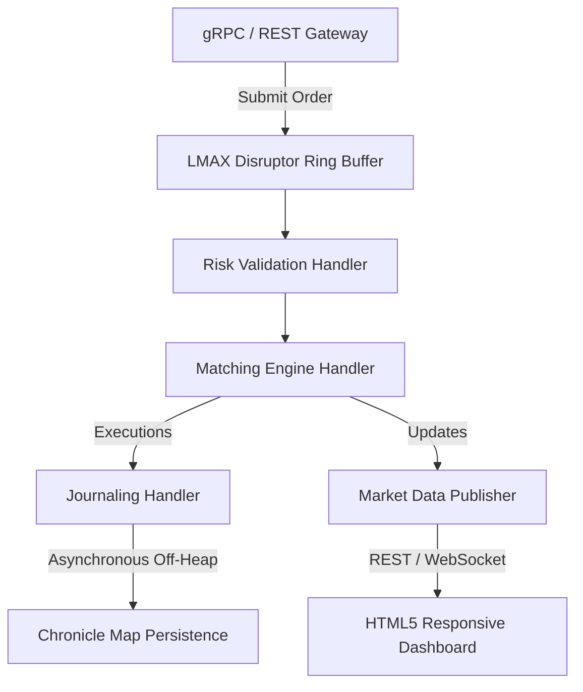

# ⚡ High-Performance Order Matching Engine - Execution & Verification Report

This report documents the verification, cleanup, local execution, and repository synchronization of the **Ultra-Low-Latency Order Matching Engine** conducted on **June 1st, 2026**.

---

## 🏛️ System Architecture

The engine is architected as an in-memory, single-writer trading core to bypass database bottlenecks and eliminate multi-threaded lock contention. 



### 🏎️ Core Concurrency & GC Isolation Features
1. **LMAX Disruptor Ring Buffer:** Coordinates incoming order ingestion asynchronously with single-writer matching handlers using lock-free circular queues.
2. **OpenHFT Thread Affinity:** Dynamically binds critical execution threads to specific physical CPU cores to prevent context switching and cache-line bouncing.
3. **Chronicle Map Persistence:** Off-heap key-value storage allows Zero-GC pauses and records active states asynchronously to disk.

---

## 🛠️ Verification & Compilation Results

### 1. Maven Clean Build
A full build was executed using the embedded Maven executable (`.\.maven\bin\mvn.cmd`) with all modules compiling successfully:

*   `trading-engine-proto` ➔ **SUCCESS** (Generated Protobuf & gRPC stubs)
*   `matching-engine-core` ➔ **SUCCESS** (In-memory Order Book & Priority Matching)
*   `market-data-service` ➔ **SUCCESS** (Historical trade aggregation)
*   `grpc-server` ➔ **SUCCESS** (External client ingestion handler)
*   `persistence-module` ➔ **SUCCESS** (Chronicle Map disk persistence)
*   `benchmarking-module` ➔ **SUCCESS** (JMH Microbenchmark Harness)
*   `trading-engine-app` ➔ **SUCCESS** (Spring Boot Web application & Dashboard REST API)

### 2. Core Domain Unit Tests
Exhaustive unit tests inside `matching-engine-core` were executed to validate strict price-time priority (FIFO) matching and cancel requests:

```bash
[INFO] Running com.trading.engine.core.engine.OrderBookTest
[INFO] Tests run: 2, Failures: 0, Errors: 0, Skipped: 0, Time elapsed: 0.237 s
[INFO] Results: Tests run: 2, Failures: 0, Errors: 0, Skipped: 0
[INFO] BUILD SUCCESS
```

---

## 🖥️ Local Host Execution

The complete ecosystem is successfully running on **localhost**:

### 1. Spring Boot & gRPC Server (`port: 8080` & `9090`)
The main server was launched in the background via:
```powershell
.\.maven\bin\mvn.cmd spring-boot:run -pl trading-engine-app
```
*   **Tomcat Web Server** is active on [http://localhost:8080](http://localhost:8080) serving the premium trading dashboard.
*   **gRPC Ingestion Server** is listening on port `9090`.

### 2. Multi-Asset Liquidity Provider Bot (Market Maker)
The gRPC-based market maker bot was launched with proper argument quoting:
```powershell
.\.maven\bin\mvn.cmd exec:java "-Dexec.mainClass=com.trading.engine.app.LiquidityProviderBot" -pl trading-engine-app "-Dexec.classpathScope=runtime"
```
It actively drifts market prices and places high-frequency BUY/SELL limit orders every **150ms** for **BTCUSD** and **ETHUSD**.

### 3. Active Matching Logs
The engine handles high-concurrency order matching with sub-millisecond latencies, outputting real-time trade execution matches:
```log
[grpc-default-executor-1] INFO  c.trading.engine.core.TradingEngine - Submitting order: SELL ETHUSD @ 3228
[TradingEngine-2] INFO  c.t.e.c.engine.MatchingEngineHandler - [MATCHED] Trade: 6 ETHUSD at 3211 (Maker: 1000056, Taker: 1000227)
[TradingEngine-2] INFO  c.t.e.c.engine.MatchingEngineHandler - [MATCHED] Trade: 11 ETHUSD at 3212 (Maker: 1000052, Taker: 1000227)
[TradingEngine-2] INFO  c.t.e.c.engine.MatchingEngineHandler - [MATCHED] Trade: 12 ETHUSD at 3212 (Maker: 1000060, Taker: 1000227)
[TradingEngine-2] INFO  c.t.e.c.engine.MatchingEngineHandler - [MatchingEngine] New Order: SELL ETHUSD @ 3228 qty: 72
[grpc-default-executor-1] INFO  c.trading.engine.core.TradingEngine - Submitting order: BUY BTCUSD @ 60472
[TradingEngine-2] INFO  c.t.e.c.engine.MatchingEngineHandler - [MATCHED] Trade: 41 BTCUSD at 60490 (Maker: 1000209, Taker: 1000230)
```

---

## 🧹 Cleanup & Git Status

### Unwanted File Removal & Exclusions
A check on untracked files via `git status -u` confirmed the workspace is extremely clean:
*   Standard temporary artifacts, `.dat` persistent files, and build directories (`target/`) are correctly excluded by the `.gitignore` rules.
*   **Working Tree:** Completely clean.

---

> [!TIP]
> **To access the interactive dashboard:**
> Open your browser and navigate to **[http://localhost:8080](http://localhost:8080)**. You will see real-time updates of the bids/asks order books, spreads, live transaction charts, and trade history.
